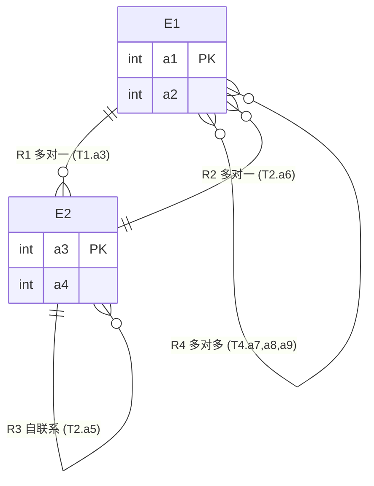
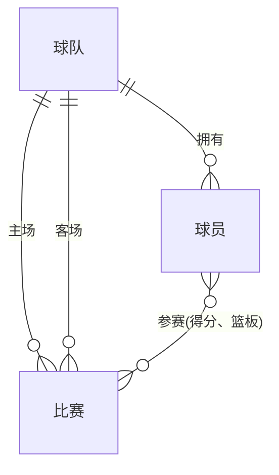
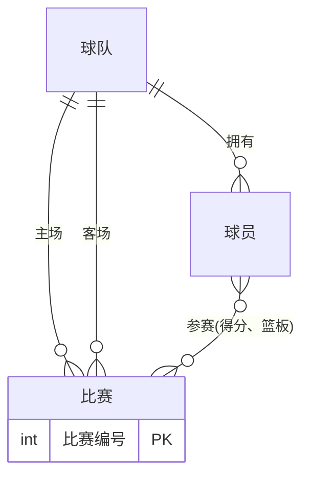

# 18春 数据库概论（陈立军）期中考试 参考答案

> 说明：本答案依据试卷原文整理。第 8 题试卷中未给出具体查询语句，仅给出判断原则；ER 图部分用文字 + Mermaid 图描述。

---

## 一、简答题（每小题 3 分，共 30 分）

### 1. 文件系统在数据管理方面有哪些不足？列举三条即可。

文件系统管理数据的主要不足（任选三条）：

1. **数据冗余与不一致**：相同数据可能分散存储在多个文件中，更新时容易产生不一致。
2. **数据共享困难**：文件通常面向具体应用，跨应用共享数据不便。
3. **数据独立性差**：应用程序往往依赖文件结构和存取方式，文件结构改变通常需要修改程序。
4. **完整性难以保证**：缺乏统一机制声明和维护数据约束。
5. **安全性与并发控制不足**：难以进行细粒度权限控制，多用户并发访问易导致数据不一致。
6. **备份恢复能力弱**：缺少事务等机制保证故障恢复。

---

### 2. 基于关系 R(A, B, C)，分别给出建立过滤索引和覆盖索引的例子。

**过滤索引（Filtered Index）**：只对满足条件的行建立索引。

```sql
CREATE INDEX idx_filter ON R(B) WHERE C > 100;
```

**覆盖索引（Covering Index）**：索引包含查询所需的所有列，避免回表。

```sql
CREATE INDEX idx_cover ON R(A, B) INCLUDE (C);
-- 或等价地
CREATE INDEX idx_cover ON R(A, B, C);
```

---

### 3. Codd 提出了 12 条全关系系统的准则，列举四条。

可列举以下任意四条：

1. **信息准则（Information Rule）**：所有信息在逻辑层都必须以表中的值显式表示。
2. **保证访问准则（Guaranteed Access Rule）**：每个数据项都能通过“表名 + 主键值 + 列名”唯一访问。
3. **空值的系统处理（Systematic Treatment of Null Values）**：支持用 NULL 表示缺失信息。
4. **基于关系模型的动态联机目录（Dynamic On-line Catalog）**：数据库描述（元数据）在逻辑层也以关系形式存储，可被查询。
5. **统一的数据子语言准则（Comprehensive Data Sublanguage Rule）**。
6. **视图更新准则（View Updating Rule）**：理论上所有可更新的视图都应能被更新。
7. **高级的插入、更新和删除操作**。
8. **数据物理独立性（Physical Data Independence）**。
9. **数据逻辑独立性（Logical Data Independence）**。
10. **数据完整性独立性（Integrity Independence）**。
11. **分布独立性（Distribution Independence）**。
12. **非破坏性准则（Nonsubversion Rule）**。

---

### 4. 列举四个和数据完整性相关的 SQL 关键字。

示例：

- `PRIMARY KEY`
- `FOREIGN KEY`
- `UNIQUE`
- `NOT NULL`
- `CHECK`
- `REFERENCES`
- `DEFAULT`

任选四个即可。

---

### 5. 数据库三级模式设计是怎样的？好处是什么？

**三级模式**：

- **外模式（External Schema / 子模式）**：用户或应用程序看到的数据视图。
- **概念模式（Conceptual Schema / 逻辑模式）**：数据库全体数据的逻辑结构和特征描述。
- **内模式（Internal Schema / 存储模式）**：数据的物理存储结构和存取方法。

**好处**：

- **数据独立性**：
  - 逻辑独立性：概念模式改变时，外模式可不变，应用程序无需修改。
  - 物理独立性：内模式改变时，概念模式可不变。
- 简化用户视图，便于数据共享、安全控制和系统维护。

---

### 6. 什么是阻抗失配？如何解决这一问题？

**阻抗失配（Impedance Mismatch）**：指关系数据库模型（表、行、列、关系）与面向对象编程语言模型（对象、类、继承、封装、多态）之间的数据模型不匹配。例如，对象之间的引用、继承、集合等特性难以直接映射到关系表中。

**解决方法**：

- 使用 **ORM（Object-Relational Mapping）** 框架，如 Hibernate、MyBatis、SQLAlchemy、Entity Framework 等。
- 在应用层手工编写数据访问层进行对象与关系数据之间的转换。
- 采用对象数据库或 NoSQL 数据库。
- 使用 JSON/XML 等半结构化数据类型在一定程度上缓解失配。

---

### 7. 触发器执行结果

已知：

```
R(A) = {1, 2}
S(B) = {3, 4, 5, 6}
```

触发器：

```sql
create trigger R_IST before insert on R 
reference old table as OT 
for each statement 
update R set A = A + (select count(*) from OT);
```

执行：

```sql
insert into R (select * from S);
```

**分析**：

- 这是一个 **BEFORE INSERT** 触发器。
- 在 SQL 标准中，INSERT 触发器的 **OLD TABLE（旧表）为空**，因为插入操作尚未产生“旧行”。
- 因此 `OT` 为空，`count(*) = 0`。
- `update R set A = A + 0` 对 R 无影响。
- 随后执行 `insert into R (select * from S)`，将 S 中所有行插入 R。

**结果**：

```
R(A) = {1, 2, 3, 4, 5, 6}
```

> 注：若将 OT 误解为触发前的当前 R 表，则会得到 {3, 4, 3, 4, 5, 6}；标准语义下 OLD TABLE 在 INSERT 时为空，故正确结果应为 {1, 2, 3, 4, 5, 6}。

---

### 8. 两个表 R(A, B)、S(A, C)，其中 A 是两个表的主码，哪些查询中的 distinct 可以去掉？

试卷原题未给出具体查询列表，因此给出判断原则：

`DISTINCT` 用于消除结果中的重复行。当查询结果天然不会产生重复时，就可以去掉 `DISTINCT`：

1. **投影列包含主码或唯一键**：若 SELECT 列表包含某关系的主码（或唯一键），则结果元组必然唯一，`DISTINCT` 可去掉。
2. **连接条件保证唯一性**：若连接条件涉及主码/唯一键的等值连接，使得结果行与某一方主码一一对应，则结果不会重复。
3. **使用了返回单值的聚集函数**：如 `MAX(...)`、`MIN(...)`、`COUNT(*)` 等，其本身只返回一行，无需 `DISTINCT`。
4. **对 GROUP BY 后的分组键查询**：若 SELECT 列表只包含分组键和聚集函数，则每个分组只输出一行，`DISTINCT` 可去掉。

---

### 9. 在 ER 设计中，什么时候会引入弱实体？什么时候会引入聚集？

**弱实体（Weak Entity）**：

- 当某个实体的存在依赖于另一个实体（标识实体），且自身没有足够属性形成独立主码时引入。
- 例如：员工的家属、订单的明细项、楼房的房间等。弱实体的主码由标识实体的主码加上自身的部分码（Discriminator）共同构成。

**聚集（Aggregation）**：

- 当需要把一个“联系”也当作一个整体（抽象实体）去参与另一个联系时引入。
- 例如：把“学生选课”这一联系聚集成“选课记录”抽象实体，再与“成绩评定”建立联系。

---

### 10. 请用基本的关系代数表达式写出计算除法的公式。

设关系 `R(X, Y)` 和 `S(Y)`，其中 `X = R - S` 是 R 中不在 S 中的属性集合。

除法 `R ÷ S` 可表示为：

```
R ÷ S = π_X(R) − π_X( (π_X(R) × S) − R )
```

含义：

- `π_X(R)` 是 R 中所有 X 的取值。
- `π_X(R) × S` 构造出“X 取值与 S 中所有 Y 的组合”。
- 减去实际存在的 R，得到“缺少某些组合”的 X 取值。
- 再从全部 X 取值中去掉这些，即得到与 S 中所有 Y 都有组合的 X 取值。

---

## 二、关系代数（20 分）

### 1. 用基本关系代数操作表示 R(A, B) 和 S(B, C) 的左外连接

左外连接保留 R 中所有元组，不能匹配时 S 的属性填 NULL：

```
R ⟕_B S = (R ⋈_B S) ∪ ( (R − π_{A,B}(R ⋈_B S)) × { (NULL_C) } )
```

其中：

- `R ⋈_B S` 是自然连接（或等值连接）。
- `R − π_{A,B}(R ⋈_B S)` 得到在 S 中没有匹配 B 值的 R 元组。
- `{ (NULL_C) }` 是一个只含一个元组的常量关系，C 属性取 NULL。
- 若要求结果属性完整，可写成 `× (NULL_B?, NULL_C)`，但由于 B 在 R 中已有，只需补 C 的 NULL。

更简洁的等价写法：

```
R ⟕_B S = (R ⋈ S) ∪ ( (R − π_{A,B}(R ⋈ S)) × { (NULL) } )
```

（第二个乘积只针对 S 中独有的属性 C 补 NULL。）

---

### 2. 已知关系 R(A)，给出计算 A 最小值的关系代数表达式

```
min_A = π_A(R) − π_A( σ_{R1.A > R2.A}( ρ_{R1}(R) × ρ_{R2}(R) ) )
```

解释：

- `ρ_{R1}(R) × ρ_{R2}(R)` 对 R 做两个重命名副本的笛卡尔积。
- `σ_{R1.A > R2.A}` 选出 R1.A 大于 R2.A 的元组，即 R1.A 不是最小值的那些。
- 用全部 A 值减去这些非最小值，剩下的就是最小值。

---

### 3. 关系 friends(ME, YOU) 去重：若同时存在 (a,b) 和 (b,a)，只保留一行

```
T1 = σ_{ME < YOU}(friends)
T2 = σ_{ME > YOU}(friends)
T3 = π_{ME,YOU}( T2 ⋈_{T2.ME = T1.YOU ∧ T2.YOU = T1.ME} T1 )

Result = T1 ∪ (T2 − T3)
```

解释：

- `T1` 保留 ME 小于 YOU 的行。
- `T2` 保留 ME 大于 YOU 的行。
- `T3` 是 T2 中那些“反向已经存在”的重复对。
- 最终结果是所有“ME < YOU”的行，加上“ME > YOU 但反向不存在”的行，保证每对无序组合只出现一次。

---

### 4. 如何检测关系 R(A, B, C) 中 A 是否取值唯一？

```
DuplicateA = π_A( σ_{R1.A = R2.A ∧ (R1.B ≠ R2.B ∨ R1.C ≠ R2.C)}( ρ_{R1}(R) × ρ_{R2}(R) ) )
```

判断方法：

- 若 `DuplicateA` 为空，则 A 取值唯一。
- 若 `DuplicateA` 非空，则 A 存在重复值。

等价方法：若 `|π_A(R)| = |R|`，则 A 取值唯一。

---

## 三、SQL（25 分）

已知关系：

- `股票(股票代码, 所属地区)`
- `板块(股票代码, 板块名称)`
- `交易(股票代码, 日期, 交易量, 开盘价, 收盘价)`

### 1. 给出在 88 这一天其所属股票全部以阳线收盘的板块名称

阳线定义：`开盘价 <= 收盘价`。

一个板块满足条件，当且仅当该板块下不存在 88 这一天收盘价低于开盘价的股票。

```sql
SELECT DISTINCT 板块名称
FROM 板块 B
WHERE NOT EXISTS (
    SELECT 1
    FROM 交易 T
    WHERE T.股票代码 = B.股票代码
      AND T.日期 = 88
      AND T.开盘价 > T.收盘价   -- 非阳线
);
```

或用 `NOT IN`：

```sql
SELECT DISTINCT 板块名称
FROM 板块
WHERE 板块名称 NOT IN (
    SELECT 板块名称
    FROM 板块 B2
    JOIN 交易 T ON B2.股票代码 = T.股票代码
    WHERE T.日期 = 88
      AND T.开盘价 > T.收盘价
);
```

---

### 2. 给出每个地区最活跃（日均交易量最大）的股票

```sql
WITH AvgVol AS (
    SELECT
        S.股票代码,
        S.所属地区,
        AVG(T.交易量) AS 日均交易量,
        RANK() OVER (PARTITION BY S.所属地区 ORDER BY AVG(T.交易量) DESC) AS rk
    FROM 股票 S
    JOIN 交易 T ON S.股票代码 = T.股票代码
    GROUP BY S.股票代码, S.所属地区
)
SELECT 股票代码, 所属地区, 日均交易量
FROM AvgVol
WHERE rk = 1;
```

---

### 3. 给出其所属股票在所有板块中都出现的地区

即：对于某个地区 D，任意板块 P 中，都至少存在一只属于 D 的股票也属于 P。

```sql
SELECT 所属地区
FROM 股票 S
WHERE NOT EXISTS (
    SELECT 板块名称
    FROM 板块
    WHERE 板块名称 NOT IN (
        SELECT 板块名称
        FROM 板块 B2
        WHERE B2.股票代码 = S.股票代码
    )
);
```

或利用“除法”思想：

```sql
SELECT 所属地区
FROM 股票 NATURAL JOIN 板块
GROUP BY 所属地区
HAVING COUNT(DISTINCT 板块名称) = (SELECT COUNT(DISTINCT 板块名称) FROM 板块);
```

---

### 4. 给出一直符合“…涨跌涨跌涨跌…”模式的股票

涨：`今日收盘价 >= 昨日收盘价`
跌：`今日收盘价 < 昨日收盘价`

该模式的反面是：存在连续三天同向变化（连续涨或连续跌）。排除这些股票即可。

```sql
SELECT DISTINCT 股票代码
FROM 交易 T
WHERE NOT EXISTS (
    SELECT 1
    FROM 交易 T1
    JOIN 交易 T2 ON T1.股票代码 = T2.股票代码 AND T2.日期 = T1.日期 + 1
    JOIN 交易 T3 ON T2.股票代码 = T3.股票代码 AND T3.日期 = T2.日期 + 1
    WHERE T1.股票代码 = T.股票代码
      AND (
          -- 连续三天涨
          (T1.收盘价 <= T2.收盘价 AND T2.收盘价 <= T3.收盘价)
          OR
          -- 连续三天跌
          (T1.收盘价 > T2.收盘价 AND T2.收盘价 > T3.收盘价)
      )
);
```

---

### 5. 对于一串不连续的数字，给出其最小缺失值

以 `1, 2, 3, 5, 6, 8, 9` 为例，最小缺失值为 `4`。

#### 方法一：集合方法

假设数字存放在表 `Nums(num INT)` 中：

```sql
SELECT MIN(num + 1) AS 最小缺失值
FROM Nums N1
WHERE num + 1 NOT IN (SELECT num FROM Nums)
  AND num < (SELECT MAX(num) FROM Nums);
```

#### 方法二：游标方法（SQL Server / T-SQL 风格）

```sql
DECLARE @min_missing INT = 1;
DECLARE @current INT;

DECLARE cur CURSOR FOR
    SELECT num FROM Nums ORDER BY num;

OPEN cur;
FETCH NEXT FROM cur INTO @current;

WHILE @@FETCH_STATUS = 0
BEGIN
    IF @current > @min_missing
        BREAK;
    IF @current = @min_missing
        SET @min_missing = @min_missing + 1;
    FETCH NEXT FROM cur INTO @current;
END

CLOSE cur;
DEALLOCATE cur;

SELECT @min_missing AS 最小缺失值;
```

游标思路：从 1 开始遍历有序数字序列，若当前数字等于期望值则期望值加 1；若当前数字大于期望值，则期望值即为最小缺失值。

---

## 四、数据库设计（25 分）

### 1. 根据表定义画出 E-R 图

表定义：

```sql
create table T1(
    a1 int primary key,
    a2 int,
    a3 int foreign key references T2(a3)
);

create table T2(
    a3 int primary key,
    a4 int,
    a5 int foreign key references T2(a3),
    a6 int foreign key references T1(a1)
);

create table T4(
    a7 int,
    a8 int,
    a9 int,
    primary key (a7, a8),
    a7 foreign key references T1(a1),
    a8 foreign key references T1(a1)
);
```

**E-R 图结构说明**：

- 实体 **E1**（对应 T1），主码 `a1`，属性 `a2`。
- 实体 **E2**（对应 T2），主码 `a3`，属性 `a4`。
- 联系 **R1（E1 → E2）**：多对一，外码 `T1.a3 → T2.a3`。
- 联系 **R2（E2 → E1）**：多对一，外码 `T2.a6 → T1.a1`。
- 联系 **R3（E2 → E2）**：多对一自联系，外码 `T2.a5 → T2.a3`。
- 联系 **R4（E1 ↔ E1）**：多对多联系，对应 T4，属性 `a9`，参与双方均为 E1，主码 `(a7, a8)`。



---

### 2. 篮球职业联盟数据库

需求：

- 球队：球队名称、所在城市
- 球员：球员姓名、薪酬
- 球员属于球队，球队拥有多位球员
- 球队之间进行主客场比赛，记录比赛时间、比赛结果（两只球队只轮流进行一次主客场比赛）
- 球员参加多场比赛，每场比赛有多位球员，记录得分、篮板等统计数据

#### (1) ER 图（不标注属性）



说明：

- 球队与球员：一对多。
- 球队与比赛：两个一对多联系（主场、客场）。
- 球员与比赛：多对多联系，带有属性“得分”“篮板”等。

#### (2) 转换为关系模式

下划线表示主码，波浪线表示外码。

- `球队(<u>球队名称</u>, 所在城市)`
- `球员(<u>球员编号</u>, 球员姓名, 薪酬, <u>球队名称</u>)`  
  外码：<u>球队名称</u> 引用 `球队(球队名称)`
- `比赛(<u>主队名称</u>, <u>客队名称</u>, 比赛时间, 比赛结果)`  
  外码：<u>主队名称</u> 引用 `球队(球队名称)`，<u>客队名称</u> 引用 `球队(球队名称)`
- `参赛统计(<u>主队名称</u>, <u>客队名称</u>, <u>球员编号</u>, 得分, 篮板)`  
  外码：(<u>主队名称</u>, <u>客队名称</u>) 引用 `比赛`，<u>球员编号</u> 引用 `球员(球员编号)`

> 注：为球员单独引入“球员编号”作为主码，因为球员姓名可能重复。

#### (3) 若两只球队之间进行多轮主客场比赛，需定义唯一比赛编号

此时“比赛”应提升为独立实体，用比赛编号作为主码。



对应关系模式：

- `球队(<u>球队名称</u>, 所在城市)`
- `球员(<u>球员编号</u>, 球员姓名, 薪酬, <u>球队名称</u>)`
- `比赛(<u>比赛编号</u>, 比赛时间, 比赛结果, <u>主队名称</u>, <u>客队名称</u>)`  
  外码：<u>主队名称</u>、<u>客队名称</u> 引用 `球队`
- `参赛统计(<u>比赛编号</u>, <u>球员编号</u>, 得分, 篮板)`  
  外码：<u>比赛编号</u> 引用 `比赛`，<u>球员编号</u> 引用 `球员`

---

*答案完。*
